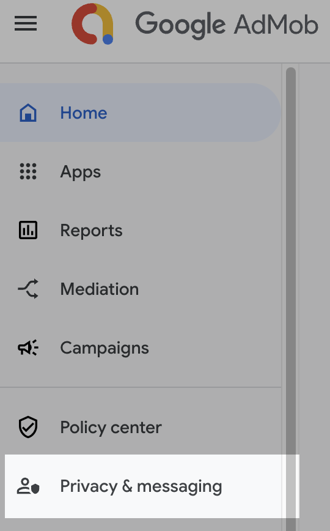
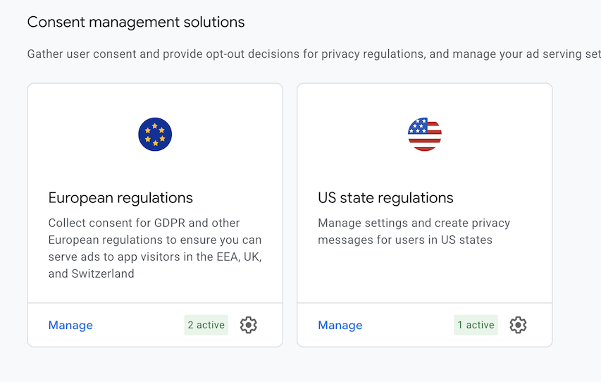

# Admob Unity Mediation and GDPR Consent

AdmobUMPAds is a Unity manager script

Handles user consent (GDPR / UMP)

Initializes Google Mobile Ads SDK

Loads & shows:

🎁 Rewarded Ads

📺 Interstitial Ads

📢 Banner Ads

## Quick Admob Integrator [Best Found]

[QuickAdMobIntegrator](https://github.com/IShix-g/QuickAdMobIntegrator)

## Ad Mediation

How to Add Mediation and what you need to import
[Admob Mediation](https://developers.google.com/admob/unity/mediation/unity)

[Mediation Networks Download .unitypackage](https://developers.google.com/admob/unity/choose-networks)

## Consent Forms

Create Consent form at admob.com

Click here in admob

Form templates are available just create and add your apps in the list

